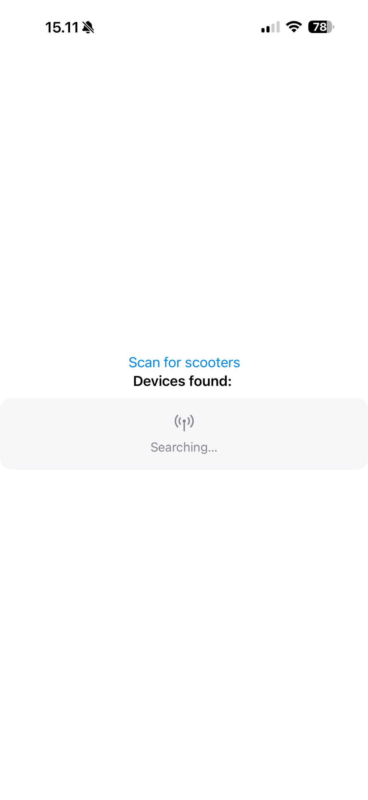
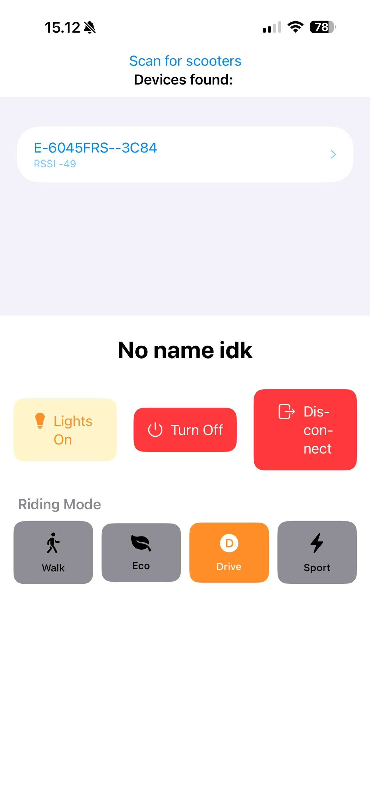

# Building

1. clone the repo
2. open the .xcodeproj file to open the project in Xcode where you can build and run it

To build the project, you have to first create `Config.xcconfig` (you can copy the example config) and add your scooter's serial number
watchOS app is embedded into the iOS app so you will need provisioning profiles for both iPhone and Apple Watch

# Screenshots

